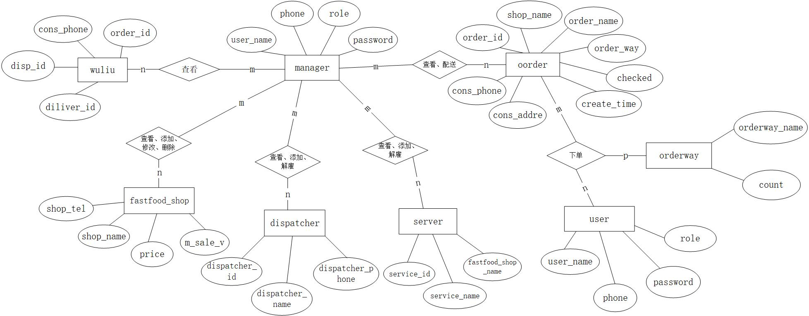

# 武汉大学国家网络安全学院教学实验报告

|   课程名称   |           数据库系统           |   实验日期   | 2024年 5月 25日 |          |
| :----------: | :----------------------------: | :----------: | :-------------: | :------: |
| **实验名称** | **数据库应用系统的设计与实现** | **实验序号** |                 |          |
|  **姓 名**   |          **学    号**          |   **专业**   |   **年级-班**   | **成绩** |
|    张贤玉    |         2022302181069          |     网安     |    22级-3班     |          |
|    傅傲川    |         2022302181119          |     网安     |    22级-4班     |          |
|    徐凡淼    |         2022302181147          |     信安     |    22级-5班     |          |
|    陈玉萍    |         2022302181151          |     网安     |    22级-5班     |          |

[TOC]

# 一.实验目的及实验内容

> 本次实验所涉及并要求掌握的知识；实验内容；必要的原理分析

## 1.1 实验目的

1. 熟悉开发实现一个数据库应用系统的基本流程。
2. 熟悉数据库操作以及应用与数据库交互过程的编写。
3. 掌握使用数据库作为工具完成访问控制的方法。
4. 掌握防止`SQL`注入的基本方法。
5. 掌握数据库并发、数据备份与恢复等功能的实现。

## 1.2 实验内容

1. 对系统进行需求分析，主要针对数据库进行需求分析，可以采用数据流图、数据字典等方式。

2. 对系统和数据库进行设计，根据需求分析的有关内容，画出系统的E-R图，并据此设计对应的数据库表结构，然后对系统进行简单范式分析等。

3. 设计实现一个数据库应用系统，Web、App等皆可，数据库、语言、平台、框架等可自选，我们小组选择的是：`windows + vue + MySQL + Flask`框架。

   要求：

1）用户登录，至少两种不同类型的用户权限访问控制；

2）用户口令哈希存储；

3）体现数据库完整性检查；

4）体现防`SQL`注入；

5）进行系统并发测试；

6）具有数据备份与恢复功能。

## 1.3 必要的原理分析

1. **熟悉开发实现一个数据库应用系统的基本流程：** 实验中涉及了前端和后端的开发，通过前端页面与用户进行交互，将用户的请求发送至后端，后端处理请求并与数据库交互，最终返回结果给前端展示。
2. **熟悉数据库操作以及应用与数据库交互过程的编写：** 后端使用 Flask 框架处理请求，并通过 `SQLAlchemy `库与数据库进行交互，执行` SQL` 查询、插入、更新等操作。
3. **掌握使用数据库作为工具完成访问控制的方法：** 实验中通过后端控制访问权限，确保用户只能访问其具有权限的数据，以及对敏感操作进行权限验证。
4. **掌握防止 `SQL` 注入的基本方法：** 为了防止` SQL` 注入，实验中使用 `SQLAlchemy `的文本查询（`text()` 方法），并通过参数化查询方式来处理用户输入的搜索关键词，而不是直接将用户输入的数据拼接到 `SQL` 查询语句中。
5. **掌握数据库并发、数据备份与恢复等功能的实现：** 对于数据库并发，可以通过数据库引擎提供的事务管理、锁机制等方式来控制并发访问；数据备份与恢复则需要定期进行数据库备份，并在需要时从备份中恢复数据，以确保数据的安全性和可靠性。

# 二.实验环境及实验步骤

> 本次实验所使用的器件、仪器设备等的情况；具体的实验步骤

## 2.1 实验环境

硬件：`windows 11`

前端：编辑器：`vscode`			框架：`vue`

后端：编辑器：`pycharm`		语言：`python` 		框架：`flask`

数据库：语言：`MySQL`			软件：`Navicat`

## 2.2 实验步骤

### 2.2.1 需求分析

**根据需求：外卖平台**

1. 首先考虑使用平台的人：用户和管理员。一开始还打算有外卖员和商家，考虑到前后端设计多个不同的页面有较大困难，因而改为不需要外卖员和商家登陆平台，让管理员指派。
2. 设计用户的表：首先需要id、用户名、密码和手机号，以id作为主键，通过手机号注册账号，同时需要填写用户的基本信息。原本打算设计一个管理员的表，发现可以和用户共用同一个表，增加一个“状态”区分是用户还是管理员。因为管理员不用填写个人信息，因此另建一个个人信息的表，将id作为外键，电话作为主键，将其他个人信息作为其他属性。
3. 设计店铺的表：需要店铺名（主键）、电话、价格，然后参考真实的外卖平台，打算添加“好评（差评）数”和“销售量”这两个属性，通过触发器实现，实现销售量：当外卖订单增加时，对应的店铺销售量会增加1；实现好评和差评：订单完成之后，用户可选择好评或差评，从而进行计算。
4. 设计外卖员的表：以编号作为主键，加上“名字”“电话”两个属性即可，管理员选择外卖员进行派送，同时可以增加外卖员和解雇外卖员。
5. 设计服务员的表：同样以编号为主键，以所属店铺和所属店铺电话为属性，同样让管理员进行增加和解雇。
6. 然后考虑到平台上需要有订单信息，在有订单信息的情况下，可以增加一个物流信息的表。
7. 设计订单信息的表：以订单编号为主键，需要有店铺名称，订单价格，取餐地点，送餐时间，顾客的电话和姓名。为了区分是否送到，增加一个“状态”属性：0表示未点餐，1表示在运送，2表示已送达。同时为了实现之前的好评差评，防止刷好评差评，需添加一个是否评价的属性，0表示未评价，1表示好评，2表示差评。同时另设计一个订餐方式的表储存不同点餐方式的数量。
8. 设计物流信息的表：以订单编号为主键，需要存有外卖员编号表示是谁送餐，另外需要顾客的电话以便送达时通知，以及预计送餐时间的属性，同时需要一个属性表示是否送达。

### 2.2.2 数据库表结构

**根据需求分析得到数据库表结构如下**

表1 用户user

|     字段名      |  类型   | 长度 | 是否为空 |             备注             |
| :-------------: | :-----: | :--: | :------: | :--------------------------: |
|     用户id      |   Int   |  10  |    否    |        需要自增(主键)        |
| 用户名username  | Varchar |  50  |    否    |            用户名            |
|  密码password   | Varchar | 500  |    否    | 密码哈希加密，所以长度要很长 |
| 电话号telephone | Varchar |  50  |    否    |             电话             |
|    角色role     |   Int   |  1   |    否    |    0表示用户，1表示管理员    |

表2  店铺fastfood_shop

|  字段名   | 字段类型 | 长度 | 是否为空 |     备注     |
| :-------: | :------: | :--: | :------: | :----------: |
| shop_name | Varchar  |  50  |    否    | 店铺名(主键) |
| shop_tel  | Varcher  |  20  |    否    |   店铺电话   |
|   Price   |   Int    |  10  |    否    |   产品价格   |
| m_sale_v  |   Int    |  10  |    否    |    销售量    |
|  hp_num   |   Int    |  10  |    否    |    好评数    |
|  cp_num   |   Int    |  10  |    否    |    差评数    |

表3 用户信息user_msg

|  字段名   | 字段类型 | 长度 | 是否为空 |           备注           |
| :-------: | :------: | :--: | :------: | :----------------------: |
|    id     |   Int    |  10  |    否    | 外键，与user的主键id对应 |
| real_name | Varchar  |  50  |    否    |         真实姓名         |
|    sex    | Varchar  |  50  |    否    |           性别           |
|    age    |   Int    |  10  |    否    |           年龄           |
|   mail    | Varchar  |  50  |    否    |           邮箱           |
|   phone   | Varchar  |  50  |    否    |        电话(主键)        |
| user_name | Varchar  |  50  |    否    |          用户名          |

表4  服务员数据表：server

|       字段名       | 字段类型 | 长度 | 是否为空 |       备注       |
| :----------------: | :------: | :--: | :------: | :--------------: |
|     service_id     | Varchar  |  50  |    否    | 服务员编号(主键) |
|    Service_name    | Varchar  |  50  |    否    |    服务员姓名    |
| fastfood_shop_name | Varchar  |  50  |    否    |   所在的店铺名   |

表5  外卖员dispatcher

|      字段名      | 字段类型 | 长度 | 是否为空 |       备注       |
| :--------------: | :------: | :--: | :------: | :--------------: |
|  dispatcher_id   | Varchar  |  50  |    否    | 送餐员编号(主键) |
| dispatcher_name  | Varchar  |  50  |    否    |    送餐员姓名    |
| dispatcher_phone | Varchar  |  50  |    否    |    送餐员电话    |

表6 订餐方式：orderway

|    字段名     | 字段类型 | 长度 | 是否为空 |        备注        |
| :-----------: | :------: | :--: | :------: | :----------------: |
| orderway_name | Varchar  |  50  |    否    |   订餐方式(主键)   |
|     count     |   Int    |  10  |    否    | 该种方式的订餐数量 |

表7 订单数据：oorder

|   字段名    | 字段类型 | 长度 | 是否为空 |                 备注                  |
| :---------: | :------: | :--: | :------: | :-----------------------------------: |
|  order_id   |   Int    |  10  |    否    |            订单编号(主键)             |
|  shop_name  | Varchar  |  50  |    否    |               店铺名称                |
| order_money |   Int    |  10  |    否    |               订单金额                |
|  order_way  | Varchar  |  50  |    否    |               订餐方式                |
| cons_phone  | Varchar  |  50  |    否    |               顾客电话                |
|  cons_name  | Varchar  |  50  |    否    |               顾客姓名                |
| cons_addre  | Varchar  |  50  |    否    |               取餐地址                |
|   checked   |   Int    |  10  |    否    | 0表示未派发1表示正在派发2表示完成派发 |
| create_time | Varchar  |  50  |    否    |               下单时间                |
|    rated    |   Int    |  10  |    否    |     0表示未评价1表示好评2表示差评     |

表8  物流数据表：wuliu  

| 字段名       | 字段类型 | 长度 | 是否为空 |             备注             |
| ------------ | :------: | ---- | -------- | :--------------------------: |
| order_id     |   Int    | 10   | 否       |        订单编号(主键)        |
| cons_phone   | Varchar  | 50   | 否       |           顾客电话           |
| disp_id      | Varchar  | 50   | 否       |          送餐员编号          |
| deliver_time | Varchar  | 50   | 否       |         预计送餐时间         |
| ended        |   Int    | 1    | 否       | 0表示送餐未结束1表示送餐结束 |

### 2.2.3 ER图设计

根据需求分析，可以画出如下的ER图：



### 2.2.4 对数据库系统进行范式分析

表1 用户user

 **id为键，不存在非主属性对键的部分函数依赖和传递函数依赖，且所有决定因素都为键，所以为BCNF。（但是要考虑一下是否允许用户名、用户密码等重复）**

表2  店铺fastfood_shop

 **shop_name为键，不存在非主属性对键的部分函数依赖和传递函数依赖，且所有决定因素都为键，所以为BCNF。**

表3 用户信息user_msg

 **phone为键，不存在非主属性对键的部分函数依赖和传递函数依赖，且所有决定因素都为键，所以为BCNF。**

表4  服务员数据表：server

 **Service_id为键，不存在非主属性对键的部分函数依赖和传递函数依赖，且所有决定因素都为键，所以为BCNF。**

表5  外卖员dispatcher

 **Dispatcher_id为键，不存在非主属性对键的部分函数依赖和传递函数依赖，且所有决定因素都为键，所以为BCNF。**

表6 订餐方式：orderway

 **orderway_name为键，不存在非主属性对键的部分函数依赖和传递函数依赖，且所有决定因素都为键，所以为BCNF。**

表7 订单数据：oorder

 **order_id为键，不存在非主属性对键的部分函数依赖和传递函数依赖，且所有决定因素都为键，所以为BCNF。**

表8  物流数据表：wuliu  

**order_id为键，不存在非主属性对键的部分函数依赖和传递函数依赖，且所有决定因素都为键，所以为BCNF。**

**注：通过对数据库的范式分析可知，所有表格设计均属于BCNF，在函数依赖范畴内可以消除更新异常。**

### 2.2.5 `SQL`语句实现

#### 1. 建表语句

通过需求分析，`ER`图，可以写出以下建表语句：

例如：送餐员`dispatcher`表。

```sql
CREATE TABLE `dispatcher` (
    `dispatcher_id` VARCHAR(50) NOT NULL,
    `dispatcher_name` VARCHAR(50) NOT NULL,
    `dispatcher_phone` VARCHAR(50) NOT NULL,
    PRIMARY KEY (`dispatcher_id`),
    UNIQUE INDEX `dispatcher_id` (`dispatcher_id`),
    INDEX `dispatcher_name` (`dispatcher_name`),
    INDEX `dispatcher_phone` (`dispatcher_phone`)
);
```

创建 `fastfood_shop `表

```sql
CREATE TABLE `fastfood_shop` (
    `shop_name` VARCHAR(50) NOT NULL,
    `price` INT NOT NULL COMMENT '价格',
    `m_sale_v` INT NOT NULL COMMENT '销售量',
    `hp_num` int NOT NULL DEFAULT 0,
  	`cp_num` int NOT NULL DEFAULT 0,
    `shop_tel` INT NOT NULL COMMENT '店铺电话',
    PRIMARY KEY (`shop_name`),
    UNIQUE INDEX `shop_name` (`shop_name`),
    INDEX `price` (`price`),
    INDEX `m_sale_v` (`m_sale_v`)
)
```

创建 `oorder `表

```sql
CREATE TABLE `oorder` (
    `order_id` INT NOT NULL AUTO_INCREMENT,
    `shop_name` VARCHAR(50) NOT NULL,
    `order_money` INT NOT NULL,
    `order_way` VARCHAR(50) NOT NULL,
    `cons_phone` VARCHAR(50) NOT NULL,
    `cons_name` VARCHAR(50) NOT NULL,
    `cons_addre` VARCHAR(50) NOT NULL,
    `checked` INT DEFAULT 0,
    `create_time` VARCHAR(50),
    `rated` INT NULL DEFAULT 0,
    PRIMARY KEY (`order_id`),
    UNIQUE INDEX `order_id` (`order_id`),
    INDEX `shop_name` (`shop_name`),
    INDEX `order_money` (`order_money`),
    INDEX `order_way` (`order_way`),
    INDEX `cons_phone` (`cons_phone`),
    INDEX `cons_name` (`cons_name`),
    INDEX `cons_addre` (`cons_addre`),
    INDEX `checked` (`checked`),
    INDEX `create_time` (`create_time`)
) ;
```

创建` orderway `表

```sql
CREATE TABLE `orderway` (
    `orderway_name` VARCHAR(50) NOT NULL COMMENT '订餐方式',
    `count` INT NOT NULL COMMENT '该种方式的订餐数量',
    PRIMARY KEY (`orderway_name`),
    UNIQUE INDEX `orderway_name` (`orderway_name`),
    INDEX `count` (`count`)
); 
```

创建 `server` 表

```sql
CREATE TABLE `server` (
    `service_id` VARCHAR(50) NOT NULL COMMENT '服务员编号',
    `service_name` VARCHAR(50) NOT NULL,
    `fastfood_shop_name` VARCHAR(50) NOT NULL COMMENT '所在的店铺名字',
    PRIMARY KEY (`service_id`),
    UNIQUE INDEX `service_id` (`service_id`),
    INDEX `service_name` (`service_name`),
    INDEX `fastfood_shop_name` (`fastfood_shop_name`)
) ; 
```

创建` user `表

```sql
CREATE TABLE `user` (
    `id` INT UNSIGNED NOT NULL AUTO_INCREMENT,
    `username` VARCHAR(20) NOT NULL,
    `password` VARCHAR(500) NOT NULL,
    `telephone` VARCHAR(20) NOT NULL,
    `role` INT NOT NULL,
    PRIMARY KEY (`id`),
    UNIQUE INDEX `id` (`id`),
    INDEX `username` (`username`),
    INDEX `password` (`password`),
    INDEX `telephone` (`telephone`),
    INDEX `role` (`role`)
);
```

创建` user_msg` 表

```sql
CREATE TABLE `user_msg` (
    `id` INT UNSIGNED NULL DEFAULT NULL,
    `real_name` VARCHAR(50) NOT NULL,
    `sex` VARCHAR(50) NOT NULL,
    `age` INT NOT NULL,
    `mail` VARCHAR(50) NOT NULL,
    `phone` VARCHAR(50) NOT NULL,
    `user_name` VARCHAR(50) NOT NULL,
    INDEX `userid` (`id`),
    INDEX `real_name` (`real_name`),
    INDEX `sex` (`sex`),
    INDEX `age` (`age`),
    INDEX `mail` (`mail`),
    INDEX `phone` (`phone`),
    INDEX `user_name` (`user_name`),
    CONSTRAINT `userid` FOREIGN KEY (`id`) REFERENCES `user` (`id`) ON DELETE RESTRICT ON UPDATE RESTRICT
) ; 
```

创建 `wuliu` 表

```sql
CREATE TABLE `wuliu` (
    `order_id` INT NOT NULL COMMENT '订单的编号',
    `cons_phone` VARCHAR(50) NOT NULL,
    `disp_id` VARCHAR(50) NOT NULL,
    `deliver_time` VARCHAR(50) NOT NULL,
    `ended` INT NOT NULL DEFAULT 0 COMMENT '是否结束',
    PRIMARY KEY (`order_id`),
    UNIQUE INDEX `order_id` (`order_id`),
    INDEX `cons_phone` (`cons_phone`),
    INDEX `disp_id` (`disp_id`),
    INDEX `deliver_time` (`deliver_time`),
    INDEX `ended` (`ended`)
) ; 
```

#### 2. 触发器设置

1. ***oorder 表的触发器：***

```sql
delimiter ;;
CREATE TRIGGER `order_insert` AFTER INSERT ON `oorder` FOR EACH ROW
BEGIN
    UPDATE orderway 
    SET count = count + 1 
    WHERE orderway_name = new.order_way;
END;;
delimiter ;
```

​	作用是自动维护 `orderway` 表中的 `count` 字段，以确保每次在 `oorder` 表中插入新订单时，对应的订单方式的计数能够自动更新。这可以保持数据的一致性，减少手动维护的复杂度和错误。

1. 当向 `oorder` 表插入一条新记录时，触发器被激活。

2. 触发器获取新插入记录中的 `order_way` 字段值。

3. 在 `orderway` 表中查找 `orderway_name` 等于新记录 `order_way` 值的行。

4. 将该行的 `count` 字段值加1，表示该订单方式的订单数量增加了一个。


```sql
delimiter ;;
CREATE TRIGGER `order_insert_sale` AFTER INSERT ON `oorder` FOR EACH ROW
BEGIN
    UPDATE fastfood_shop 
    SET m_sale_v = m_sale_v + 1 
    WHERE shop_name = new.shop_name;
END;;
delimiter ;
```

​	作用是自动维护 `fastfood_shop` 表中的 `m_sale_v` 字段，以确保每次在 `oorder` 表中插入新订单时，对应餐厅的销售量计数能够自动更新。这可以保持数据的一致性，减少手动维护的复杂度和错误。

1. 当向 `oorder` 表插入一条新记录时，触发器被激活。

2. 触发器获取新插入记录中的 `shop_name` 字段值。

3. 在 `fastfood_shop` 表中查找 `shop_name` 等于新记录 `shop_name` 值的行。

4. 将该行的 `m_sale_v` 字段值加1，表示该餐厅的销售量增加了一个。


```sql
delimiter ;;
CREATE TRIGGER `order_update` AFTER UPDATE ON `oorder` FOR EACH ROW
BEGIN
    IF (new.order_way != old.order_way) THEN
        UPDATE orderway 
        SET count = count - 1 
        WHERE orderway_name = old.order_way;
        UPDATE orderway 
        SET count = count + 1 
        WHERE orderway_name = new.order_way;
    END IF;
END;;
delimiter ;
```

​	作用是确保在 `oorder` 表中 `order_way` 字段更新时，自动维护 `orderway` 表中的计数，反映不同订单方式的使用情况。这可以保持数据的一致性，减少手动维护的复杂度和错误。

1. 当 `oorder` 表中的一条记录被更新时，触发器被激活。

2. 触发器首先检查 `order_way` 字段的新值 (`new.order_way`) 是否不同于旧值 (`old.order_way`)。

3. 如果 `order_way`字段的值发生了变化：

   1）在 `orderway` 表中找到 `orderway_name` 等于旧的   `order_way` 的记录，并将该记录的 `count` 字段值减1。

   2）在 `orderway` 表中找到 `orderway_name` 等于新的 `order_way` 的记录，并将该记录的 `count` 字段值加1。

```sql
delimiter ;;
CREATE TRIGGER `order_delete` AFTER DELETE ON `oorder` FOR EACH ROW
BEGIN
    UPDATE orderway 
    SET count = count - 1 
    WHERE orderway_name = old.order_way;
END;;
delimiter ;
```

​	作用是确保在 `oorder` 表中记录删除时，自动维护 `orderway` 表中的计数，反映不同订单方式的使用情况。这可以保持数据的一致性，减少手动维护的复杂度和错误。

1. 当 `oorder` 表中的一条记录被删除时，触发器被激活。
2. 触发器在 `orderway` 表中查找 `orderway_name` 等于被删除记录的 `order_way` 值的记录。
3. 找到对应记录后，将该记录的 `count` 字段值减1。

```sql
delimiter ;;
CREATE TRIGGER `order_delete_sale` AFTER DELETE ON `oorder` FOR EACH ROW
BEGIN
    UPDATE fastfood_shop 
    SET m_sale_v = m_sale_v - 1 
    WHERE shop_name = old.shop_name;
END;;
delimiter ;
```

​	作用是确保在 `oorder` 表中记录删除时，自动维护 `fastfood_shop` 表中的销售数量，反映不同餐馆的销售情况。这可以保持数据的一致性，减少手动维护的复杂度和错误。

1. 当 `oorder` 表中的一条记录被删除时，触发器被激活。
2. 触发器在 `fastfood_shop` 表中查找 `shop_name` 等于被删除记录的 `shop_name` 值的记录。
3. 找到对应记录后，将该记录的 `m_sale_v` 字段值减1。

2. ***wuliu 表的触发器***

```sql
delimiter ;;
CREATE TRIGGER `wuliu_insert` AFTER INSERT ON `wuliu` FOR EACH ROW
BEGIN
	UPDATE oorder 
    SET checked = 1 
    WHERE order_id = new.order_id;
END;;
delimiter ;
```

​	作用是确保在 `wuliu` 表中插入新记录时，自动更新 `oorder` 表中相应订单的 `checked` 状态，表示订单已处理。这样可以保持数据的一致性，简化订单处理流程的管理。

1. 当 `wuliu` 表中插入一条新记录时，触发器被激活。

2. 触发器在 `oorder` 表中查找 `order_id` 等于新插入记录的 `order_id` 值的记录。

3. 找到对应记录后，将该记录的 `checked` 字段值设置为 1。

   作用是确保在 `wuliu` 表中插入新记录时，自动更新 `oorder` 表中相应订单的 `checked` 状态，表示订单已处理。这样可以保持数据的一致性，简化订单处理流程的管理。

3. ***好评触发器***

```sql
DELIMITER $$
CREATE TRIGGER update_hp_num AFTER UPDATE ON oorder
FOR EACH ROW
BEGIN
    IF NEW.rated = 1 AND OLD.rated != 1 THEN
        UPDATE fastfood_shop
        SET hp_num = hp_num + 1
        WHERE shop_name = NEW.shop_name;
    END IF;
END$$
DELIMITER ;
```

​	作用是确保当 `oorder` 表中的订单被评价时，自动更新 `fastfood_shop` 表中对应商店的 `hp_num` 字段，增加该商店的好评数量。这样可以保持数据的一致性，简化评价系统的管理。

1. 当 `oorder` 表中更新了一条记录时，触发器被激活。
2. 触发器检查 `rated` 字段的值是否从非 1 变为 1。
3. 如果条件满足，在 `fastfood_shop` 表中找到 `shop_name` 等于新记录中 `shop_name` 的记录，并将其 `hp_num` 字段值增加 1。

4. ***差评触发器***

```sql
DELIMITER $$
CREATE TRIGGER update_cp_num AFTER UPDATE ON oorder
FOR EACH ROW
BEGIN
    IF NEW.rated = 2 AND OLD.rated != 2 THEN
        UPDATE fastfood_shop
        SET cp_num = cp_num + 1
        WHERE shop_name = NEW.shop_name;
    END IF;
END$$
DELIMITER ;
```

​	作用是确保当 `oorder` 表中的订单被评价时，自动更新 `fastfood_shop` 表中对应商店的 `hp_num` 字段，增加该商店的好评数量。这样可以保持数据的一致性，简化评价系统的管理。

1. 当 `oorder` 表中更新了一条记录时，触发器被激活。
2. 触发器检查 `rated` 字段的值是否从非 1 变为 1。
3. 如果条件满足，在 `fastfood_shop` 表中找到 `shop_name` 等于新记录中 `shop_name` 的记录，并将其 `hp_num` 字段值增加 1。

#### 3. 视图

本数据库中建立了两个视图，视图sending_order展示了正在派送中的订单的完整的信息，包括有oorder表中的全部字段，wuliu表中的deliver字段，dispatcher表中的dispatcher_phone字段。oorder表与wuliu表由order_id实现连接，wuliu表与dispatcher由dispatcher_id实现连接。而视图sended_order展示已经派发完成的所有订单的信息 。

```sql
-- 创建 sended_order 视图
DROP VIEW IF EXISTS `sended_order`;
CREATE ALGORITHM=UNDEFINED SQL SECURITY DEFINER VIEW `sended_order` AS 
    SELECT `oorder`.`order_id` AS `order_id`,
        `oorder`.`shop_name` AS `shop_name`,
        `oorder`.`order_money` AS `order_money`,
        `oorder`.`order_way` AS `order_way`,
        `oorder`.`cons_phone` AS `cons_phone`,
        `oorder`.`cons_name` AS `cons_name`,
        `oorder`.`cons_addre` AS `cons_addre`,
        `wuliu`.`disp_id` AS `disp_id`,
        `wuliu`.`deliver_time` AS `deliver_time`,
        `dispatcher`.`dispatcher_phone` AS `dispatcher_phone`
    FROM ((`oorder`
        JOIN `wuliu` ON ((`oorder`.`order_id` = `wuliu`.`order_id`)))
        JOIN `dispatcher` ON ((`wuliu`.`disp_id` = `dispatcher`.`dispatcher_id`)))
    WHERE (`oorder`.`checked` = 2); 
    
-- 创建 sending_order 视图
DROP VIEW IF EXISTS `sending_order`;
CREATE ALGORITHM=UNDEFINED SQL SECURITY DEFINER VIEW `sending_order` AS 
    SELECT `oorder`.`order_id` AS `order_id`,
        `oorder`.`shop_name` AS `shop_name`,
        `oorder`.`order_money` AS `order_money`,
        `oorder`.`order_way` AS `order_way`,
        `oorder`.`cons_phone` AS `cons_phone`,
        `oorder`.`cons_name` AS `cons_name`,
        `oorder`.`cons_addre` AS `cons_addre`,
        `wuliu`.`disp_id` AS `disp_id`,
        `wuliu`.`deliver_time` AS `deliver_time`,
        `dispatcher`.`dispatcher_phone` AS `dispatcher_phone`
    FROM ((`oorder`
        JOIN `wuliu` ON ((`oorder`.`order_id` = `wuliu`.`order_id`)))
        JOIN `dispatcher` ON ((`wuliu`.`disp_id` = `dispatcher`.`dispatcher_id`)))
    WHERE (`oorder`.`checked` = 1); 
```

#### 4. 索引

为了提高查找的速度，对于每一个表都对其主键建立unique索引，在其余每个属性上都建立了normal索引，索引方法选择BTREE.

索引是数据库中用于提高查询速度的一种技术。在关系型数据库中，索引类似于书的目录，它可以帮助数据库快速地定位到存储数据的位置，从而加快查询的速度。

唯一索引（unique index）：对主键建立唯一索引，保证了主键的唯一性，避免了重复数据的插入。唯一索引可以加速对唯一标识的查询和检索速度，例如：

```sql
UNIQUE INDEX shop_name (shop_name),
UNIQUE INDEX order_id (order_id),
UNIQUE INDEX orderway_name (orderway_name),
UNIQUE INDEX service_id (service_id)
```

普通索引（normal index）：对每个属性建立了普通索引，这样在查询时可以更快地定位到对应属性值的数据记录。通过普通索引，数据库可以更高效地执行查询，提高检索速度，例如：

```sql
 INDEX `price` (`price`),
 INDEX `m_sale_v` (`m_sale_v`)
```

`BTREE `索引：`BTREE `是一种索引结构，它是一种树形结构，通过对索引列的值进行排序，可以快速地定位到目标记录。`BTREE `索引适用于范围查询和排序，因此在需要对索引列进行范围查询或排序的情况下，`BTREE `索引可以提高查询的效率。

通过建立唯一索引和普通索引，以及选择适当的索引方法，可以显著提高数据库的查询性能，减少查询时间，提高系统的响应速度。

### 2.2.6 系统功能说明

#### 1. 用户登录，至少两种不同类型的用户权限访问控制

设置了用户和管理员两种类型的用户权限，同时设计了选择身份登录的页面。并且保证用户不可以在管理员登录界面登陆，同样的，管理员不可以在用户界面登录。


在登录界面，实现用户和管理员两个登陆端口。


在用户端口，能实现点餐、查看订单、查看并修改个人信息。


在管理员端口，主要能实现的功能有“店铺管理”，“服务员管理”，“送货员管理”，“物流管理”，“订单管理”。

```sql
CREATE TABLE `user` (
    `id` INT UNSIGNED NOT NULL AUTO_INCREMENT,
    `username` VARCHAR(20) NOT NULL,
    `password` VARCHAR(500) NOT NULL,-- 增长（因为hash处理之后，数据太长）
    `telephone` VARCHAR(20) NOT NULL,
    `role` INT NOT NULL,
    PRIMARY KEY）
```

在`SQL`语句中，创建user时增加role属性，role为0时，表示user为用户；role为1时，表示user时是管理员。

```python
role = rq.get("role")
# 插入 user 表
        db.session.execute(text(
            'insert into user(username, password, telephone, role) values(:username, :password, :telephone, :role)'),
            {"username": username, "password": hashed_password, "telephone": telephone, "role": role})
        db.session.commit()
```

在注册过程中，根据前端界面，使用者所选择的“用户”或“管理员”，对该用户的role进行赋值，并存入数据库。

```python
role = request.json.get("role")  
```

在登录过程中，同样根据用户的前端选择，读取用户role信息。

```python
sql = 'select * from user where telephone = :telephone and role = :role'
    data = db.session.execute(text(sql), {"telephone": userortel, "role": role}).first()
```

根据手机号和角色信息查询数据库，仅当手机号和角色都相同时，该端口的用户名才存在，才能进行登录。

#### 2. 用户口令哈希存储

安装用户密码哈希存储所需要的库：

```python
from flask_bcrypt import Bcrypt
bcrypt = Bcrypt(app)
```

用户注册时将密码进行哈希处理：

```python
hashed_password = bcrypt.generate_password_hash(password).decode('utf-8')
```

​	生成一个安全的哈希值，使用 `bcrypt` 算法对密码进行加密。这种加密方式非常适合用于存储密码，因为它具有抗攻击性，难以被破解。由于哈希值很长，因而在建表时需要将密码的长度设置的很长。

效果展示：user表的password字段：


#### 3. 体现数据库完整性检查

（1）在创建表时，通过指定主键约束来定义主键。主键约束将强制确保主键值的唯一性和非空性。在试图插入重复的主键值或者插入空值，数据库将拒绝该操作并返回错误。
（2）并且创建一个唯一性索引来实现了主键完整性检查。该索引将阻止插入重复的主键值，并确保主键是唯一的。
 
(3)在创建表时，通过指定外键约束来定义外键。外键约束将强制确保外键引用的值在关联表中存在。如果试图插入一个外键引用不存在的值，数据库将拒绝该操作并返回错误。

注：通过主键和外键的完整性检查，可以确保数据库中的数据一致性和准确性。这些约束将防止无效的数据插入、更新或删除操作，并促使数据库保持良好的结构和关系。

#### 4. 体现防`SQL`注入

SQL注入是一种常见的网络安全威胁，攻击者通过在用户输入中插入恶意的SQL代码，从而可以执行未经授权的数据库操作。在 Flask 应用中，防止 SQL 注入攻击的主要方法是使用参数化查询。参数化查询是通过在 SQL 查询中使用占位符来代替实际的参数值，然后将参数值作为参数传递给数据库驱动程序，而不是将参数直接插入 SQL 查询字符串中。这样可以有效防止恶意用户通过注入 SQL 代码来破坏数据库查询。

```python
# 插入 user 表
        db.session.execute(text(
            'insert into user(username, password, telephone, role) values(:username, :password, :telephone, :role)'),
            {"username": username, "password": hashed_password, "telephone": telephone, "role": role})
        db.session.commit()

        # 获取新插入用户的 ID
        new_user_id = db.session.execute(text('select id from user where telephone=:telephone'), {"telephone": telephone}).fetchone()[0]
```

以用户的注册登录作为数据增加的例字，text() 函数用于创建SQL文本，但真正的变量值并不是直接嵌入到SQL语句中的，而是通过后面的字典参数来传递的。字典中的键（如 :telephone、:username 等）在SQL语句中作为占位符，而对应的值则在字典中给出。这种做法确保了用户输入的数据不会被解释为SQL代码的一部分，从而防止了SQL注入攻击。

```python
order = db.session.execute(text('SELECT rated FROM oorder WHERE order_id=:order_id'), {"order_id": order_id}).fetchone()
            print("Order details:", order)
            app.logger.info("Order details: %s", order)
            if order and order[0] == 0:  # 使用正确的整数索引访问元组中的元素
                # 更新订单状态为好评
                db.session.execute(text('UPDATE oorder SET rated=1 WHERE order_id=:order_id'), {"order_id": order_id})
                db.session.commit()
```

在店铺的好评处理中，首先要检查用户是否已经评价过，若未评价过后再更新订单好评，代码使用text()函数和参数化查询来构建SQL语句，并通过字典将变量值绑定到SQL语句中的占位符（:order_id）。这确保了用户输入（在这里是order_id）不会被解释为SQL代码的一部分，从而防止了SQL注入攻击。

#### 5. 具有数据备份与恢复功能

1.数据库备份与恢复的方法及步骤：     
  参考链接：
    https://blog.csdn.net/qq_38105536/article/details/104061074
    https://blog.csdn.net/wfqiong_123/article/details/106500026
    数据库的备份与恢复直接借助`Navicat`实现，方法如下：
    

**方法一：**
    首先打开`Navicat`与本地数据库连接以后，打开我们创建的数据库后点击备份，点击新建备份
    
    然后输入注释后点击备份
    
    然后等待一下，备份完成。
    
    然后就可以看到我们备份好的文件。
    
    恢复的时候点击备份，还原备份即可恢复数据库。
    

 **方法二：**
    直接鼠标右键单击自己创建的数据库，点击转储`SQL`文件
    
    就会自动生成为一个.sql文件，将其保存在自己的文件夹中即可。
    
    恢复数据库时，连接到本地数据库后，新建一个数据库，鼠标右键单击新建的数据库，选择运行SQL文件。
    
    选择之前转储的.sql文件
    
    选择后点击运行，完成后点击关闭即可，就可以恢复之前创建的数据库了。
    
2.使用`Navicat`备份恢复的好处
（1）简便易用：`Navicat`提供了直观的用户界面，使备份和恢复过程更加简单和易于操作。
（2）拥有多种备份选项：`Navicat`支持多种备份类型和选项，如完整备份、增量备份等，使用户可以根据需求选择最合适的备份策略。
（3）数据完整性保护：通过定期备份数据库，可以保护数据免受意外删除、数据损坏或系统故障等情况的影响，确保数据的完整性和可靠性。
（4）灵活的恢复选项：`Navicat`提供了多种恢复选项，如覆盖、合并等，使用户可以根据需要选择恢复数据库的方式。
（5）数据库版本兼容性：`Navicat`对多种数据库管理系统（如`MySQL`、`Oracle`、`SQL Server`等）提供支持，因此可以方便地备份和恢复不同类型的数据库。
（6)自动化计划备份：`Navicat`还提供了计划备份功能，可以设置定期自动备份数据库，减少手动操作的需求。

#### 6. 其他功能测试

**1.1 用户下订单**

点击“酸汤粉”店铺进行订餐：


**管理员与用户界面都会出现`未发货订单`**

- 用户界面未发货订单：


- 管理员界面未发货订单：


**用户可以修改订单**

可以修改姓名和地址。例如：


修改成功！地址发生相应的变化。


**用户可以在未发货前取消订单**

比如我们新增一条数据之后在删除。


删除成功：


**1.2 管理员派发订单**

**管理员可以选择送餐员进行派发：**


**管理员与用户界面都会出现`已发货订单`**

- 用户界面都会出现`已发货订单`

  

- 管理员界面都会出现`已发货订单`

  

**管理员可以看见`进行中物流`**


**用户可以点击确认收货，确认收货之后，管理员与用户界面都会出现`已完成订单`**

- 用户界面都会出现`已完成订单`


- 管理员界面都会出现`已完成订单`


**管理员可以看见`已完成物流`**


**1.3用户对已完成订单进行点评 **

**点击好评差评：**


**对应的店铺好评数或者差评数量+1**

原先：好评数量为2.


点评之后：好评数+1.


**根据字段的设置，只能评价一次。**


**1.4 用户修改密码**

**检查输入旧密码哈希是否和旧密码相同，将新密码哈希处理后存入数据库表`user`中。**

后端如下：

```python
if data and bcrypt.check_password_hash(data[2], old_pwd):
      new_hashed_pwd = bcrypt.generate_password_hash(new_pwd).decode('utf-8')
      db.session.execute(text('update user set password=:new_password where telephone=:telephone'),
                               {"new_password": new_hashed_pwd, "telephone": phone})
      db.session.commit()
      return jsonify(status=200, msg="修改成功")
else:
      return jsonify(status=1000, msg="原始密码错误")
```

例如：原始密码是`Qq123456`，当填写了一个错误密码则会报错;


否则，成功：


**1.5 管理员对店铺的管理**

**添加店铺**


添加成功：


**修改店铺**

可以修改电话，单价和月销量，比如修改涨价了：


修改成功：


**删除店铺**

删除`羊肉粉`店铺：


删除成功：


**1.6 管理员对服务员的管理**

**添加服务员**，可以从先存在的所有店铺选择。


添加成功：


**解雇服务员**

解雇`张贤玉`服务员：


解雇成功：


**1.7 管理员对送餐员的管理**

> 和服务员一个道理。

**添加送餐员**


添加成功：


**解雇送餐员**

解雇`张贤玉`送餐员：


解雇成功：


### 2.2.7 前后端交互、后端与数据库交互

#### 1. 前后端交互

1. **用户请求**:
   - 用户在前端界面（如表单提交、搜索操作等）进行操作。
   - 前端通过`Axios`发送HTTP请求到后端相应的`API`接口。
2. **后端处理请求**:
   - Flask后端接收到请求后，根据路由处理相应的业务逻辑。
   - 后端从请求中提取必要的数据（如查询参数、表单数据等）。
   - 后端通过数据库查询或更新操作来获取或修改数据。
3. **后端响应**:
   - 后端处理完请求后，将结果数据封装成`JSON`格式的响应。
   - 响应中包含状态码、消息和数据。
   - Flask返回该`JSON`响应给前端。
4. **前端处理响应**:
   - 前端接收到后端的响应后，根据状态码判断请求是否成功。
   - 如果请求成功，前端将数据显示在界面上（如表格、弹窗等）。
   - 如果请求失败，前端会显示相应的错误提示信息。

#### 2. 后端与数据库交互

后端使用`SQLAlchemy`来与数据库进行交互。以下是主要的交互过程：

1. **建立数据库连接**:
   
    - 在`config.py`文件中创建配置数据库连接的类，并在主文件`app.py`中导入并添加配置
    
    
    
2. **执行查询操作**:
    - 使用`SQLAlchemy`执行`SQL`查询，从数据库中检索数据。
    ```python
    data = db.session.execute(text('SELECT * FROM fastfood_shop WHERE shop_name LIKE :search_query'),
                              {"search_query": f"%{search_query}%"}).fetchall()
    ```

3. **执行插入操作**:
    - 使用`SQLAlchemy`执行插入语句，将数据插入数据库。
    ```python
    db.session.execute(text(
        'insert into user(username, password, telephone, role) values(:username, :password, :telephone, :role)'),
        {"username": username, "password": hashed_password, "telephone": telephone, "role": role})
    db.session.commit()
    ```

4. **事务管理**:
    - 使用`db.session.commit()`提交事务，确保数据的持久化。
    - 使用`db.session.rollback()`回滚事务，处理异常情况。

### 2.2.8 对系统进行性能测试 

**本实验采用了`Jmeter`对本次完成的系统应用进行了性能测试,从以下几个方面进行:**

> 参考博客:http://t.csdnimg.cn/RQ71D

#### 1. 响应时间

> 分析每个请求的平均响应时间、最大响应时间和最小响应时间。较长的响应时间可能表明系统存在性能问题。

**1.1 设置100个线程用户循环访问**

设置如图：


得到测试结果如图：

汇总报告：


图表结果：


平均响应时间为539ms，表示大多数请求的处理速度较快，但最大响应时间为1143ms，表明在某些情况下系统可能会出现性能波动。


**1.2设置100个管理员循环访问**

汇总报告：


图表结果：


平均响应时间为466ms，表示大多数请求的处理速度较快，但最大响应时间为666ms，表明在某些情况下系统可能会出现性能波动。

响应时间在不同的负载条件下都有所变化，但总体上系统在高负载下的性能表现较为稳定。

#### 2. 吞吐量

> 吞吐量指的是系统在单位时间内处理的请求数量。较高的吞吐量表示系统能够处理更多的请求，性能更好。

**1.1 设置100个用户循环访问**

从图中可以看出，吞吐量为：172.9/s。

**1.2 设置100个管理员循环访问**

从图中可以看出，吞吐量为：196.2/s。

系统在100个用户和100个管理员循环访问时都能保持较高的吞吐量，表明系统具有良好的并发处理能力。

#### 3. 并发用户数

> 分析测试期间系统能够同时处理的最大并发用户数。系统能够承受的最大并发用户数是评价系统性能的重要指标之一。

**1.1 设置1000个用户同时访问**


汇总报告：


图表结果：


响应时间分布图：


从上可以看出：

并发测试本系统，异常率：0.217。异常率表示系统在高负载下请求失败的比例。21.7%的异常率表明，系统在并发情况下有较大比例的请求未能成功处理。这可能是由于资源耗尽、数据库锁争用、网络延迟、应用层错误等多种原因导致的。

吞吐量：373.55248412401943/s，吞吐量表示系统每秒钟处理的请求数。373.55次请求/秒的吞吐量显示出系统在高并发情况下的处理能力。尽管这一数值显示系统能够在一定负载下处理大量请求，但较高的异常率表明系统处理能力需要进一步提升。

最大响应时间：4064ms，最小响应时间：11ms。 响应时间的最大值和最小值反映了系统在不同负载情况下的性能波动。11毫秒的最小响应时间表明，在低负载下，系统处理请求非常迅速。而4064毫秒的最大响应时间显示出在高负载情况下，某些请求处理时间过长，需要进一步分析这些请求的具体情况，以找出性能瓶颈。

从响应时间分布图可知：

- **初始阶段**: 系统响应时间较高，表明在开始时系统负载较重，资源分配不足。
- **中间阶段**: 响应时间呈现下降趋势，表明系统逐渐进入稳定状态，资源分配和处理效率有所改善。
- **后期阶段**: 整体呈现下降趋势，系统性能有所提升，响应时间逐渐减少。

**1.2 1000个管理员同时访问**

汇总报告：


图表结果：


响应时间分布：


从上可以看出：

并发测试本系统，异常率：0.07692307692307693。系统在并发情况下有部分请求未能成功处理。这可能是由于资源耗尽、数据库锁争用、网络延迟等原因导致的。

吞吐量：493.9209726443769/s，吞吐量表示系统每秒钟处理的请求数。493.92次请求/秒的吞吐量显示出系统在高并发情况下具有较高的处理能力。此值表明系统能够在较高负载下有效地处理大量请求。

最大响应时间：240ms，最小响应时间：3ms。 响应时间的最大值和最小值反映了系统在不同负载情况下的性能波动。3毫秒的最小响应时间表明，在低负载下，系统处理请求非常迅速。而240毫秒的最大响应时间显示出在高负载情况下，某些请求处理时间较长。

从响应时间分布图可知：

- **初始阶段**: 系统响应时间较低，表明在开始时系统能够快速处理请求。
- **中间时期**: 系统处于一种高响应时间的稳定状态。这可能是因为系统资源（如CPU、内存、数据库连接等）接近饱和，导致处理速度减慢。
- **整体趋势**: 响应时间呈现先低后高，再逐渐稳定，之后略有降低的趋势。这说明系统在高负载下经历了资源分配和优化过程，使得响应时间逐渐趋于稳定。

#### 4. 错误率

> 检查测试期间出现的错误率。较高的错误率可能表明系统存在缺陷或性能问题。

**1.1 设置100个用户循环访问**

从上面的图可以看出，异常率为7.68%，显示出系统在高负载下有少量请求失败，需要进一步优化。

**1.2 设置100个管理员循环访问**

从上面的图可以看出，异常率为8.35%，显示出系统在高负载下有少量请求失败，需要进一步优化。

错误率在不同的负载条件下都有所变化，但总体上系统在高负载下的性能表现较为稳定。

#### 5. 响应时间分布

> 分析响应时间的分布情况，查看是否存在异常或异常值。可以绘制响应时间的分布图，以便更直观地评估系统性能。

**1.1 设置100个用户循环访问**

响应时间分布图：


整体呈现一种波动。

**1.2 设置100个管理员循环访问**

响应时间分布图：


整体呈现先增加，然后稳定，之后下降。

#### 6. 负载测试

> 进行负载测试，逐步增加并发用户数和请求量，观察系统在不同负载下的性能表现。这有助于确定系统的性能极限和瓶颈。

**1.1 增大用户数量循环访问**

继续增大用户请求数。

汇总报告：


图表结果：


响应时间分布图：


可以看出，当用户数目增多之后，异常率降低了，但是吞吐量也降低了。响应时间也相对稳定。

**1.2 增大管理员数量循环访问**

继续增大用户请求数。

汇总报告：


图表结果：


响应时间分布图：


可以看出，当用户数目增多之后，异常率降低了，但是吞吐量也降低了。响应时间在中期表现出相对的稳定。随着管理员数目增大，响应时间也跟着增大，并表现出在另一个长的时间上表现出相对的稳定。

# 三.实验过程分析

> 实验分工，详细记录实验过程中发生的故障和问题，进行故障分析，说明故障排除的过程及方法。根据具体实验，记录、整理相应的数据表格等

## 3.1 实验分工

我们四个人均针对自己完成的板块进行实验报告的书写。

1. 张贤玉：

   设计对应的`SQL`建表语句、视图设计。

   完成用户登录，至少两种不同类型的用户权限访问控制。

   改进并完善项目，修改前后端数据库进行完善功能，以满足更多要求。

   对系统进行功能和性能的测试。

   对实验报告进行最终的合并整理并补充完善。

   

2. 傅傲川：

   对整个项目进行需求分析并设计相关的表格内容。

   设置触发器、索引并对其内容进行解释。

   完成用户口令哈希存储，修改后端实现将哈希处理过的密码存入数据库。

   测试项目的功能是否完整，并提出改进想法。

   

3. 徐凡淼：

   根据需求分析，设计ER图。

   修改后端使用参数化查询，防止` SQL `注入攻击，确保了 数据库的安全性。

   网页的美工，负责改进用户界面，包括网页布局、颜色选择、图标等。

   

4. 陈玉萍：

   对数据库进行范式分析。

   修改数据库主键外键并且说明如何体现数据库完整性检查。

   完善项目，使其具有数据备份与恢复功能。

## 3.2 实验故障

**1. 在实现用户口令哈希存储；**

口令太长，之前建表的字段长度没考虑到。


​	还遇见

解决方法：

```python
 # 将密码进行哈希处理
    hashed_password = bcrypt.generate_password_hash(password).decode('utf-8')
```

```python
 # 使用 bcrypt.check_password_hash 函数验证密码
        if bcrypt.check_password_hash(hashed_password, password):
```

修改函数，即可解决:


**2. 用户登录界面，忘记密码部分，出错**


修改代码，然后出现第二个错误


很奇怪。

检查前后端代码，很好，发现字段名写错，修改。成功!


**3. 在进行系统的并发测试时，一直出错**


进入系统，按`f12`, 发现原来网页端口并不是`8080`，而是`5000`

如图：


重新开始，很好成功！


# 四.实验结果总结

> 对实验结果进行分析，完成思考题目，总结实验成员每人的实验心得体会，并提出实验的改进意见

**实验心得体会：**

1. 张贤玉：

   这次实验我们设计了一个之前从未接触过的项目。从数据库`SQL`语句的实现，其中重要的是理解数据之间的关系，如何高效、准确地从数据库中提取和存储数据。到前后端的完成，这是一个不断试错、不断修改完善的过程。一点点增加功能，保证每个功能都正常实现，这种逐步推进的方式，应为不仅降低了项目的风险，也让我们有更多的时间去优化和完善每一个细节。最后对系统进行功能、性能的测试，都花费了不少的精力，当然这个过程让我深刻体会到了测试的重要性。只有通过严格的测试，才能确保项目的质量和稳定性。同时，我也学会了如何使用各种测试工具和方法，来发现和解决问题。

   回顾整个项目过程，我深深地感受到了每一步都是环环相扣的，每一步都需要仔细琢磨。这次数据库大作业，不仅让我掌握了更多的技术知识，更重要的是，它让我学会了与大家一起探讨修改完善、如何解决问题、如何追求卓越。最后也是终于实现，很开心。

   

2. 傅傲川:  

   这次的实验让我收获颇丰，在此之前，我并没有怎么学习并运用过前后端的知识，因此如何在两三周以内迅速上手成为了我这次实验最大的挑战。首先我们先确定了打算完成的平台，然后我根据需求设计了相应的库，并与此同时学习如何将前后端和数据库的知识相结合。在建表时我使用了navicat，实在是非常好用，建立的表和各种关系都一目了然。之后我负责了给密码进行哈希加密，这个功能其实并不困难，只是加密之后哈希值很长，超过了我一开始设置的长度，反反复复检查了几遍才发现问题所在，之后进行功能测试时也经常遇到一些奇奇怪怪的bug，最后发现只是因为一些小问题。总体而言，这次实验不仅强化了我的数据库操作和编程能力，还培养了我在实际开发中解决问题的综合能力。通过这些实际操作，我深刻理解了理论与实践结合的重要性，在平台上自己添加功能也很锻炼思维能力，这将对我未来的学习和职业发展有很大的帮助。

   

3. 徐凡淼：

   经过这次数据库实验，我收获颇丰，对数据库理论知识有了更深入的理解，团队创建一个数据库系统，动手设计一个网络页面，锻炼了我的动手能力。在本次实验中，遇到的问题有：在注册登录时反复出错，起初我以为是网络问题或是后端有误，在经过查阅资料和寻求队友帮助后，我明白了是由于密码经过哈希加密后过长，超出了数据库中预设的字长，导致注册失败，说明在数据库系统的搭建中，我们必须全盘的考虑问题，对于前后端连接以及后端和数据库的连接问题都要提前预设。通过这次数据库实验让我收获了很多宝贵的经验和教训，对数据库也有了更进的认识。

   

4. 陈玉萍:  

   通过本次数据库实验，我对于数据库的设计以及数据库的完整性约束都有了更多的理解，而且数据库的设计是一个需要注重很多细节的设计实验，所以在设计的过程中可能会遇到很多小问题，都要去慢慢地耐心解决，并且小组内实现分工，大家各司其职又能够互相帮助，让我们的设计进程更加顺利，同时也明白了在选择设计需要的软件和工具时也很重要，这可以帮助我们提前解决一些不必要的麻烦，在设计的过程中更要多多进行测试，这样才可以让设计出的平台更加完善。

# 五.教师评语

## 全组评语


## 个人评语

> 本组同学姓名，队长排第一，其他同学随后

1. 张贤玉

   

2. 傅傲川

   

3. 徐凡淼

   

4. 陈玉萍


